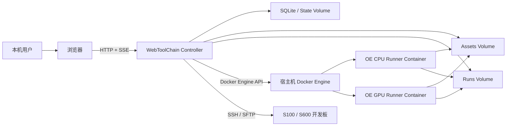
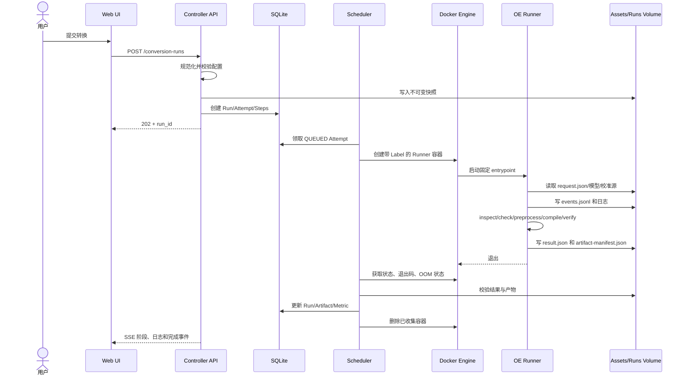
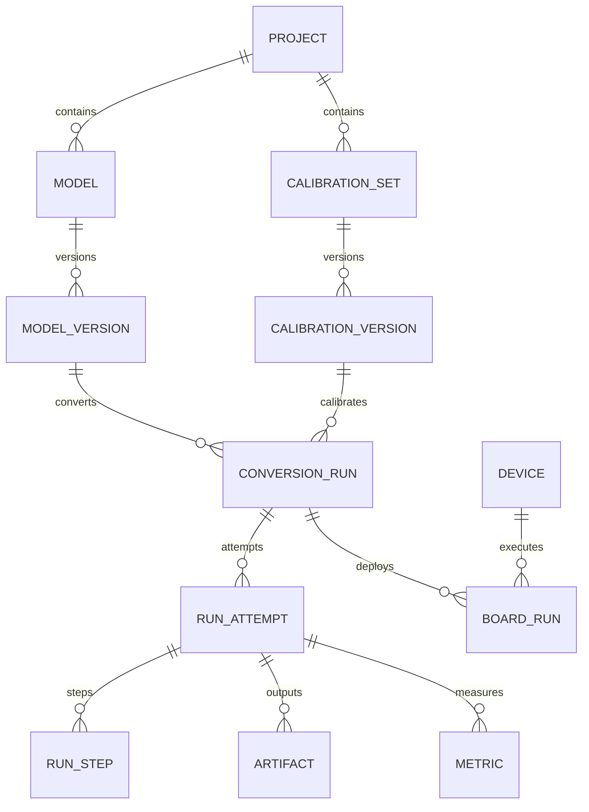

# RDK WebToolChain 项目设计文档

| 属性 | 内容 |
|---|---|
| 文档版本 | 0.1 |
| 文档状态 | Draft |
| 更新日期 | 2026-07-19 |
| 对应 PRD | [PRD 0.1](./PRD.md) |
| 部署模型 | 本地单机、Docker Compose |
| Docker 模式 | Docker-outside-of-Docker |
| 首个 Adapter | OpenExplorer 3.7.0 |

## 1. 文档目的

本文档定义 RDK WebToolChain 的工程架构和实现边界，包括：

- 本地部署拓扑。
- Web/API/调度器/Runner 的职责。
- 宿主机 Docker Engine 调用方式。
- S100/S600 Target Profile。
- 转换任务状态机和 Runner 合约。
- SQLite 数据模型、文件布局和 HTTP API。
- 安全、恢复、测试、发布和版本演进方案。

本文档面向前端、后端、Runner、测试和维护人员。产品范围和验收要求以 [PRD](./PRD.md) 为准。

## 2. 架构结论

项目采用“本地模块化单体控制面 + 临时工具链任务容器”的架构：

1. 用户通过本机浏览器访问 WebToolChain。
2. Controller 容器同时提供静态 Web、REST API、SSE、SQLite 和本地任务调度。
3. Controller 挂载宿主机 Docker Socket，通过 Docker Engine API 创建任务容器。
4. 每个 Run Attempt 创建一个短生命周期 OpenExplorer Runner 容器。
5. Runner 只获得只读资产卷和可写运行卷，不获得 Docker Socket。
6. S100/S600 差异由版本化 Target Profile 统一控制。
7. 任务输入、配置、版本、日志和产物均持久化到本机。
8. 板端验证作为独立模块，由 Controller 通过 SSH/SFTP 调用开发板工具。

## 3. 关键架构决策

### 3.1 本地优先

- 默认监听 `127.0.0.1`。
- 不引入公网服务或云依赖。
- 不实现多租户和账号体系。
- 不主动发送遥测。
- 工具链镜像准备完成后支持离线工作。

### 3.2 Docker-outside-of-Docker

Controller 通过 `/var/run/docker.sock` 使用宿主机 Docker Engine，不在 Controller 内运行新的 `dockerd`。

选择原因：

- 直接复用用户已有镜像、NVIDIA Runtime、缓存和存储。
- 临时任务容器生命周期清晰。
- CPU/GPU Runner 可以按任务切换。
- 不需要 `--privileged` DinD 容器。
- 任务容器停止后不会丢失 Controller 数据。

代价：Docker Socket 等价于高权限宿主机控制，因此必须使用固定镜像、固定 entrypoint 和严格参数白名单。

### 3.3 模块化单体控制面

Controller 使用一个可部署单元，内部按领域分模块，不拆分独立微服务。首期默认只有一个 API/Scheduler 实例。

### 3.4 SQLite 作为元数据存储

本地单用户、默认单任务并发不需要 PostgreSQL。SQLite 开启 WAL，负责保存项目、模型索引、配置、队列、状态和产物元数据。

大文件不进入 SQLite，只保存相对路径、大小、哈希和 MIME 类型。

### 3.5 Named Volume 作为持久化边界

使用 Docker Named Volume 避免“控制容器路径被宿主机 Docker Daemon 误解析”的问题。Controller 创建子容器时只传递预配置的 Volume Name，不接受请求中的宿主机路径。

### 3.6 一次 Attempt 一个 Runner 容器

一次执行尝试在同一个 Runner 容器中完成检查、预处理、编译、验证和产物收集，确保整个过程使用完全相同的工具链环境。

### 3.7 规范化 JSON 是配置事实来源

Web 表单和导入 YAML 最终都转换成规范化 JSON。Adapter 校验 JSON 后生成工具链 YAML，避免直接执行未经验证的任意 YAML。

## 4. 系统上下文



## 5. 物理部署拓扑

### 5.1 宿主机

首期支持：

- Ubuntu 22.04 x86_64。
- Docker Engine。
- Docker Compose。
- 可选 NVIDIA Driver 和 NVIDIA Container Toolkit。
- 本机浏览器。

### 5.2 容器与卷

| 名称 | 类型 | 生命周期 | 用途 |
|---|---|---|---|
| `rdkwt-controller` | 长期容器 | 随应用启动 | Web/API/调度/SQLite/Docker 管理 |
| `rdkwt-run-<id>-a<n>` | 临时容器 | 每个 Attempt | OpenExplorer 任务执行 |
| `rdkwt-state` | Named Volume | 持久 | SQLite、设置、密钥、迁移信息 |
| `rdkwt-assets` | Named Volume | 持久 | 原始 ONNX、原始校准文件、导入资源 |
| `rdkwt-runs` | Named Volume | 持久 | 快照、工作目录、日志、报告、产物 |
| `rdkwt-cache` | Named Volume，可选 | 可清理 | 预处理和编译缓存 |
| Host export dir | Bind Mount，可选 | 用户管理 | HBM/报告显式导出 |

Runner 不得挂载 `rdkwt-state` 或 Docker Socket。

### 5.3 Compose 草案

以下为结构示意，实际字段由实现阶段确定：

```yaml
services:
  controller:
    image: rdk-webtoolchain/controller:${RDKWT_VERSION}
    container_name: rdkwt-controller
    restart: unless-stopped
    ports:
      - "127.0.0.1:${RDKWT_PORT:-8080}:8080"
    group_add:
      - "${DOCKER_GID}"
    volumes:
      - /var/run/docker.sock:/var/run/docker.sock
      - rdkwt-state:/state
      - rdkwt-assets:/assets
      - rdkwt-runs:/runs
      - rdkwt-cache:/cache
      - ${RDKWT_EXPORT_DIR:-./exports}:/exports
    environment:
      RDKWT_BIND_HOST: "0.0.0.0"
      RDKWT_STATE_DIR: /state
      RDKWT_ASSETS_DIR: /assets
      RDKWT_RUNS_DIR: /runs
      RDKWT_EXPORT_DIR: /exports
      RDKWT_ASSETS_VOLUME: rdkwt-assets
      RDKWT_RUNS_VOLUME: rdkwt-runs
      RDKWT_CACHE_VOLUME: rdkwt-cache
      RDKWT_PUBLIC_ORIGIN: http://127.0.0.1:${RDKWT_PORT:-8080}

volumes:
  rdkwt-state:
    name: rdkwt-state
  rdkwt-assets:
    name: rdkwt-assets
  rdkwt-runs:
    name: rdkwt-runs
  rdkwt-cache:
    name: rdkwt-cache
```

说明：

- Controller 在容器内监听 `0.0.0.0:8080`，但 Compose 只发布到宿主机 `127.0.0.1`。
- 将 Docker Socket 标记为只读不能限制 Docker API 的管理语义，因此不能将 `:ro` 当作安全措施。
- `DOCKER_GID` 由安装检查脚本读取宿主机 Socket Group ID。
- 子容器只接收固定 Volume Name，不接收前端提供的路径。
- 卸载流程不得自动执行 `docker compose down -v`。

## 6. 代码与运行组件

### 6.1 Controller

推荐技术栈：

- Python 3.11 或项目统一版本。
- FastAPI。
- Pydantic。
- SQLAlchemy 2.x。
- Alembic。
- Docker SDK for Python 或封装后的 Engine API Client。
- SQLite WAL。
- React + TypeScript + Vite 构建出的静态资源。

Controller 作为单进程或单实例运行，内部包含：

```text
Controller
├── HTTP API
├── Static Web Server
├── SSE Event Stream
├── Application Services
├── Persistent Scheduler
├── Docker Gateway
├── Artifact Service
├── Board Gateway
├── SQLite Repository
└── Startup Reconciler
```

### 6.2 前端

推荐：

- React + TypeScript。
- Vite。
- TanStack Query 负责服务端状态。
- React Hook Form + Schema Validator 负责复杂表单。
- 路由采用 Browser Router；Controller 对未知前端路由回退到 `index.html`。

### 6.3 Runner

Runner 是复制到或构建进 OpenExplorer 基础镜像中的固定 Python 程序。Controller 不能将任意 shell 命令传给 Runner。

建议构建两个本地镜像：

```text
rdk-webtoolchain/oe-runner-cpu:oe3.7.0-app0.1
rdk-webtoolchain/oe-runner-gpu:oe3.7.0-app0.1
```

示意 Dockerfile：

```dockerfile
ARG OE_BASE_IMAGE
FROM ${OE_BASE_IMAGE}

COPY runner /opt/rdkwt-runner
ENV PYTHONUNBUFFERED=1
ENTRYPOINT ["python3", "-m", "rdkwt_runner"]
```

专有基础镜像不进入公共构建流水线，Runner 派生镜像由用户本地或合规的私有环境构建。

### 6.4 Toolchain Adapter

Adapter 隔离 OpenExplorer 版本差异，接口概念如下：

```python
class ToolchainAdapter(Protocol):
    adapter_id: str
    request_schema_version: str

    def inspect_model(self, context, request) -> ModelInspection: ...
    def validate_config(self, context, request) -> ValidationReport: ...
    def render_config(self, context, request) -> RenderedConfig: ...
    def check_model(self, context, request) -> StepResult: ...
    def preprocess(self, context, request) -> StepResult: ...
    def compile(self, context, request) -> StepResult: ...
    def verify(self, context, request) -> StepResult: ...
    def collect(self, context, request) -> RunResult: ...
```

OpenExplorer 3.7.0 相关命令、字段、默认值和输出解析只能出现在该 Adapter 及其测试中。

### 6.5 Board Gateway

Board Gateway 位于 Controller 内部，使用 SSH/SFTP 连接开发板。转换 Runner 默认没有网络，也不持有板端凭据。

职责：

- 设备预检。
- HBM/输入文件上传。
- 固定目录创建和清理。
- `hrt_model_exec model_info/infer/perf`。
- 日志和 profile 文件下载。
- 结果解析。

## 7. 领域模块

Controller 按以下模块组织：

| 模块 | 职责 |
|---|---|
| `system` | 预检、版本、健康状态、存储统计 |
| `projects` | 项目生命周期 |
| `assets` | 上传、哈希、去重、下载、删除 |
| `models` | ONNX 元数据和模型版本 |
| `calibration` | 校准集、Recipe、样本清单 |
| `profiles` | S100/S600 能力配置 |
| `configs` | 规范化配置、校验、YAML 渲染 |
| `runs` | Run/Attempt/Step 状态 |
| `scheduler` | 持久队列和并发控制 |
| `docker_gateway` | 容器创建、日志、停止、删除、reconcile |
| `artifacts` | 产物索引、预览、下载、导出 |
| `reports` | CSV/JSON/HTML 解析和指标生成 |
| `devices` | 开发板设置、凭据和连接检查 |
| `board_runs` | 板端模型信息、推理和性能任务 |
| `settings` | 镜像、资源、保留和导出配置 |

模块间通过应用服务调用，不允许前端路由直接操作 Docker SDK 或文件系统。

## 8. 核心执行流程

### 8.1 标准转换时序



### 8.2 Run 与 Attempt

- Run 表示一份不可变输入快照。
- Attempt 表示该快照的一次实际执行。
- 环境故障重试会增加 Attempt。
- 修改任何配置会创建新的 Run。
- 每个 Attempt 有独立工作目录、日志和结果，不能覆盖前次执行。

### 8.3 状态机

#### Run 状态

```text
DRAFT
  └─ SUBMITTED
       ├─ QUEUED
       ├─ RUNNING
       ├─ SUCCEEDED
       ├─ FAILED
       ├─ CANCELLED
       └─ INTERRUPTED
```

#### Attempt 状态

| 当前状态 | 允许进入 | 触发 |
|---|---|---|
| `QUEUED` | `PROVISIONING`、`CANCELLED` | Scheduler 领取或用户取消 |
| `PROVISIONING` | `RUNNING`、`FAILED`、`CANCELLED` | 容器启动成功/失败 |
| `RUNNING` | `COLLECTING`、`FAILED`、`CANCELLED`、`INTERRUPTED` | 容器退出、取消或丢失 |
| `COLLECTING` | `SUCCEEDED`、`FAILED` | 结果校验 |
| 终态 | 无 | 不可修改，只能新建 Attempt |

#### Step 状态

```text
PENDING → RUNNING → SUCCEEDED
                  → FAILED
                  → CANCELLED
PENDING           → SKIPPED
```

### 8.4 成功门禁

`SUCCEEDED` 必须满足：

1. 容器退出码为 0。
2. Runner `result.json.status` 为 `succeeded`。
3. 工具链编译步骤退出码为 0。
4. HBM 文件存在、大小大于 0、哈希计算成功。
5. 配置、版本和日志文件存在。
6. Artifact Manifest 能通过 schema 校验。

任何一项失败都进入 `FAILED`，并使用明确错误码。

## 9. Target Profile 设计

### 9.1 Profile 目标

Target Profile 是平台能力的唯一来源，禁止 UI 或导入 YAML 绕过。Profile 文件纳入版本管理，并在 Run 中保存快照。

### 9.2 Profile 示例

```yaml
schema_version: "1"
profile_id: "s100-oe-3.7.0"
display_name: "S100"
toolchain_adapter: "openexplorer-3.7.0"
platform: "s100"
march: "nash-e"
operator_catalog: "j6em"
capabilities:
  core_num:
    allowed: [1]
    default: 1
  max_l2m_size:
    mode: "disabled"
    allowed: [0]
    default: 0
  compile_mode:
    allowed: ["latency", "bandwidth", "balance"]
    default: "latency"
  optimize_level:
    allowed: ["O0", "O1", "O2"]
    default: "O2"
```

```yaml
schema_version: "1"
profile_id: "s600-oe-3.7.0"
display_name: "S600"
toolchain_adapter: "openexplorer-3.7.0"
platform: "s600"
march: "nash-p"
operator_catalog: "j6p"
capabilities:
  core_num:
    allowed: [1, 2]
    default: 1
  max_l2m_size:
    mode: "optional"
    supports_auto: true
    minimum_bytes: 0
    maximum_bytes: 25165824
    default: 0
  compile_mode:
    allowed: ["latency", "bandwidth", "balance"]
    default: "latency"
  optimize_level:
    allowed: ["O0", "O1", "O2"]
    default: "O2"
```

### 9.3 平台校验规则

| 规则 | S100 | S600 |
|---|---|---|
| `march` | 强制 `nash-e` | 强制 `nash-p` |
| `core_num` | 仅 1 | 1 或 2 |
| `max_l2m_size` | 强制 0 | 关闭、自动或合法值 |
| 算子资料 | j6em | j6p |

`march` 不出现在普通用户可编辑表单中，只展示由平台选择推导出的值。

## 10. 规范化转换配置

### 10.1 顶层结构

```json
{
  "schema_version": "1",
  "mode": "standard_ptq",
  "model": {
    "asset_id": "uuid",
    "format": "onnx",
    "sha256": "..."
  },
  "target": {
    "profile_id": "s100-oe-3.7.0",
    "profile_version": "1"
  },
  "inputs": [],
  "calibration": {},
  "compiler": {},
  "verification": {}
}
```

### 10.2 输入配置

输入采用数组，每个字段绑定输入名：

```json
{
  "name": "input",
  "source_shape": [1, 3, 224, 224],
  "target_shape": [1, 3, 224, 224],
  "train_type": "rgb",
  "train_layout": "NCHW",
  "runtime_type": "nv12",
  "runtime_source": "pyramid",
  "normalization": {
    "mean": [123.675, 116.28, 103.53],
    "scale": [0.01712475, 0.017507, 0.01742919],
    "std": []
  }
}
```

生成 OpenExplorer YAML 时，Adapter 再按工具要求转换为分号分隔字符串。领域层不保存隐式的分号编码。

### 10.3 校准配置

```json
{
  "dataset_version_id": "uuid",
  "sample_manifest_sha256": "...",
  "recipe_version_id": "uuid",
  "algorithm": "default",
  "sample_limit": 100,
  "allow_pseudo_calibration": false
}
```

没有 `cal_data_dir` 时只能在用户明确选择快速功能验证模式后使用伪校准。标准转换必须有真实校准集。

### 10.4 编译配置

```json
{
  "compile_mode": "latency",
  "balance_factor": null,
  "core_num": 1,
  "optimize_level": "O2",
  "max_l2m_size": 0,
  "max_time_per_fc": 0,
  "jobs": 8,
  "cache_mode": "disable"
}
```

### 10.5 跨字段校验

校验层级：

1. JSON Schema/Pydantic 类型校验。
2. ONNX 输入节点关联校验。
3. Target Profile 能力校验。
4. 工具链 Adapter 版本校验。
5. 文件和校准 Manifest 校验。

主要规则：

- 动态输入必须提供目标 Shape。
- NV12 图像宽高必须为偶数。
- 多输入节点不得重名或遗漏。
- Mean/Scale/Std 数量必须合法。
- `compile_mode=balance` 时必须有 `balance_factor`。
- S100 `core_num` 只能为 1，L2M 只能关闭。
- S600 L2M 不得超过 Profile 上限。
- 输出前缀仅允许 `[A-Za-z0-9_.-]`，实际路径由系统生成。
- `working_dir` 永远由 Runner 管理，不接受用户值。

### 10.6 YAML 生成

Adapter 生成：

```yaml
model_parameters:
  onnx_model: /assets/blobs/sha256/ab/abcdef.onnx
  march: nash-e
  working_dir: /runs/<run-id>/attempts/1/work/model_output
  output_model_file_prefix: resnet18_224x224_nv12

input_parameters:
  input_name: "input"
  input_type_rt: "nv12"
  input_type_train: "rgb"
  input_layout_train: "NCHW"
  input_shape: "1x3x224x224"
  mean_value: "123.675 116.28 103.53"
  scale_value: "0.01712475 0.017507 0.01742919"

calibration_parameters:
  cal_data_dir: /runs/<run-id>/attempts/1/work/calibration/input

compiler_parameters:
  compile_mode: latency
  core_num: 1
  optimize_level: O2
  max_l2m_size: 0
```

生成后执行第二次 schema 和路径校验，再写入不可变快照。

## 11. Runner 合约

### 11.1 合约文件

每个 Attempt 使用：

```text
request.json
events.jsonl
stdout.log
stderr.log
result.json
artifact-manifest.json
```

### 11.2 request.json

示例：

```json
{
  "contract_version": "1.0",
  "run_id": "56a7...",
  "attempt": 1,
  "adapter": "openexplorer-3.7.0",
  "runner_mode": "cpu",
  "pipeline": [
    "inspect",
    "check",
    "preprocess",
    "compile",
    "collect"
  ],
  "paths": {
    "model": "blobs/sha256/ab/abcdef.onnx",
    "calibration_source": "calibration-sets/uuid/source",
    "attempt_root": "56a7.../attempts/1"
  },
  "configuration": {},
  "limits": {
    "timeout_seconds": 14400,
    "max_log_bytes": 104857600
  }
}
```

路径均为相对于各卷根目录的逻辑路径。Runner 解析后必须验证真实路径仍位于指定根目录，禁止 `..`、绝对路径和符号链接逃逸。

### 11.3 events.jsonl

每行一个 JSON：

```json
{
  "sequence": 42,
  "timestamp": "2026-07-19T08:30:12.123Z",
  "level": "info",
  "step": "compile",
  "type": "progress",
  "progress": 63,
  "code": "OE_COMPILE_RUNNING",
  "message": "Compiling quantized model"
}
```

约束：

- `sequence` 在 Attempt 内单调递增。
- `message` 仅作为展示，不用于状态判断。
- 状态判断使用 `type`、`step`、`code` 和最终 `result.json`。
- 原始工具输出同时写入日志文件并转发到容器 stdout/stderr。

### 11.4 result.json

```json
{
  "contract_version": "1.0",
  "run_id": "56a7...",
  "attempt": 1,
  "status": "succeeded",
  "started_at": "2026-07-19T08:20:00Z",
  "finished_at": "2026-07-19T08:38:00Z",
  "steps": [],
  "toolchain_versions": {
    "openexplorer": "3.7.0",
    "hmct": "2.6.5",
    "hbdk": "4.7.5"
  },
  "metrics": {},
  "warnings": [],
  "error": null,
  "artifact_manifest": "artifact-manifest.json"
}
```

### 11.5 Artifact Manifest

```json
{
  "schema_version": "1",
  "artifacts": [
    {
      "kind": "hbm",
      "relative_path": "artifacts/resnet18_224x224_nv12.hbm",
      "size_bytes": 12345678,
      "sha256": "...",
      "mime_type": "application/octet-stream",
      "required": true
    }
  ]
}
```

Controller 不信任 Manifest 中的路径；入库前重新进行路径边界、普通文件、符号链接、大小和哈希校验。

### 11.6 Runner 命令执行

Runner 使用参数数组：

```python
subprocess.Popen(
    ["hb_compile", "--config", config_path],
    cwd=attempt_work_dir,
    stdout=subprocess.PIPE,
    stderr=subprocess.PIPE,
    start_new_session=True,
)
```

禁止：

- `shell=True`。
- 将用户输入拼接进 `bash -c`。
- 从 request 接收任意可执行文件。
- 从 request 接收环境变量名称和值的自由字典。

### 11.7 信号与取消

Runner 捕获 SIGTERM：

1. 写入取消事件。
2. 向当前子进程组发送 SIGTERM。
3. 等待配置的宽限时间。
4. 必要时发送 SIGKILL。
5. 写入尽可能完整的 `result.json`。
6. 以约定的取消退出码结束。

Controller 取消流程：

1. 数据库写 `cancel_requested_at`。
2. 调用 Docker Stop。
3. 超时后 Kill。
4. 收集退出状态和日志。
5. 标记 CANCELLED。
6. 删除容器。

## 12. OpenExplorer 3.7.0 Pipeline

### 12.1 Inspect

检查：

- 文件可读性。
- ONNX IR/opset。
- 输入输出和动态维度。
- external data。
- 算子类型统计。

P0 对 external data 模型给出明确不支持提示；P1 支持安全 Bundle 导入。

### 12.2 Check

命令概念：

```text
hb_compile --model <model> --march <profile.march> [--input-shape ...]
```

S100 必须是 `nash-e`，S600 必须是 `nash-p`。

输出解析优先级：

1. 工具生成的结构化文件。
2. 版本化日志正则。
3. 原始日志供用户查看。

### 12.3 Preprocess

预处理 Recipe 使用受控 Registry：

```text
DecodeImage
Resize
ShortSideResize
CenterCrop
Letterbox
ColorConvert
Transpose
Cast
Mean
Scale
Normalize
SaveNpy
```

每个操作拥有：

- `operation_id`。
- 版本。
- 输入/输出 dtype 和 Shape 规则。
- 参数 schema。
- 可视化能力标记。

Runner 根据文件名排序不能作为样本唯一顺序；Calibration Manifest 必须明确样本 ID 和源文件哈希。

### 12.4 Compile

标准命令：

```text
hb_compile --config <generated.yaml>
```

快速性能模式单独处理：

```text
hb_compile --fast-perf --model <model> --march <march> ...
```

`fast-perf` 不与普通 YAML 配置混用，并在 UI 中标记为非精度转换结果。

### 12.5 Verify

P1 支持：

- HBRuntime ONNX/BC 单样本推理。
- `hb_verifier` 合法模型组合。
- HBM 模拟器或板端一致性。

Adapter 必须根据工具限制判断可比较组合，例如启用特定 Batch 拆分或 L2M 后可能不支持部分比较。

### 12.6 Collect

识别：

- `*_original_float_model.onnx`。
- `*_optimized_float_model.onnx`。
- `*_calibrated_model.onnx`。
- `*_ptq_model.onnx`。
- `*_quantized_model.bc`。
- `*_quantized_removed_model.bc`。
- `*.hbm`。
- `*_node_info.csv`。
- `*_quant_info.json`。
- `*_advice.json`。
- 静态性能 HTML/JSON。
- `hb_compile.log`。

`*_node_info.csv`、性能 JSON 和 quant info 优先作为结构化指标来源。日志解析只补充未结构化信息。

## 13. Docker Gateway 设计

### 13.1 职责

Docker Gateway 是 Controller 内唯一允许调用 Docker SDK 的模块：

- Engine Ping/Info/Version。
- 镜像存在性和 digest 查询。
- 创建、启动、检查、停止和删除任务容器。
- 日志流读取。
- 按 Label 查询遗留容器。
- OOM/退出状态识别。

其他模块不得直接依赖 Docker SDK。

### 13.2 容器命名和 Label

容器名：

```text
rdkwt-run-<run-id-short>-a<attempt>
```

固定 Label：

```text
io.drobotics.rdkwt.managed=true
io.drobotics.rdkwt.app_version=<version>
io.drobotics.rdkwt.run_id=<uuid>
io.drobotics.rdkwt.attempt=<integer>
io.drobotics.rdkwt.contract_version=1.0
```

所有查询、停止和删除都必须同时核对：

- `managed=true`。
- Run ID。
- Attempt。
- 数据库中的 Container ID。

### 13.3 固定容器配置

| 配置 | 默认 |
|---|---|
| Image | 设置中允许列表的 digest |
| Entrypoint | 镜像内固定，不被请求覆盖 |
| Docker Socket | 不挂载 |
| Assets Volume | `/assets:ro` |
| Runs Volume | `/runs:rw` |
| State Volume | 不挂载 |
| Network | `none` |
| Privileged | false |
| PID/IPC | private |
| Capabilities | 尽可能 `drop: ALL`，以兼容性测试为准 |
| Auto remove | false，收集完成后显式删除 |
| Stop timeout | 设置默认值，可在系统设置中调整 |

任务请求不得覆盖以上字段。

### 13.4 CPU Runner

可配置：

- CPU 数量/权重。
- 内存上限。
- PIDs 上限。
- 任务超时。
- `/tmp` tmpfs 或受限临时目录。

### 13.5 GPU Runner

在 CPU 配置基础上增加 Docker DeviceRequest：

- Driver：NVIDIA。
- Capabilities：GPU。
- Device ID 或 count 由本地设置选择，不由普通 Run Request 自由传入。
- 共享内存默认值参考 OpenExplorer GPU 启动脚本，可由管理员设置。

Controller 自身不需要挂载 GPU。

### 13.6 Image Allowlist

设置表保存：

- 逻辑 Runner ID。
- CPU/GPU 类型。
- Repository:tag。
- 解析后的 image ID/digest。
- Runner 合约版本。
- 工具链版本。
- 是否启用。

创建任务时使用冻结的 digest。Tag 后续指向其他镜像不会改变已提交 Run。

### 13.7 不允许的 Docker 操作

产品 API 不提供：

- 任意镜像拉取。
- 任意 Dockerfile 构建。
- 任意容器命令。
- 任意 Volume 创建/挂载。
- 任意网络选择。
- `privileged`、host PID、host IPC。
- 宿主机设备直通，GPU Allowlist 除外。
- 全局 container/image/volume prune。

## 14. 持久化文件设计

### 14.1 State Volume

```text
/state/
├── db/
│   └── rdkwt.sqlite3
├── secrets/
│   ├── application.key
│   └── device-credentials/
├── migrations/
└── backups/
```

只挂载给 Controller。

### 14.2 Assets Volume

```text
/assets/
├── blobs/
│   └── sha256/
│       └── ab/
│           └── abcdef...
├── model-bundles/
├── calibration-sets/
│   └── <dataset-version-id>/
│       ├── source/
│       └── manifest.json
└── upload-staging/
```

- Blob 以内容哈希寻址。
- 数据库保存展示文件名。
- Runner 只读挂载。
- 删除资产前进行引用计数检查。

### 14.3 Runs Volume

```text
/runs/
└── <run-id>/
    ├── snapshot/
    │   ├── normalized-config.json
    │   ├── generated-config.yaml
    │   ├── target-profile.yaml
    │   ├── version-manifest.json
    │   └── asset-manifest.json
    └── attempts/
        └── 1/
            ├── request.json
            ├── events.jsonl
            ├── logs/
            │   ├── runner.log
            │   ├── stdout.log
            │   ├── stderr.log
            │   └── hb_compile.log
            ├── work/
            │   ├── calibration/
            │   └── model_output/
            ├── artifacts/
            ├── reports/
            ├── result.json
            └── artifact-manifest.json
```

### 14.4 原子写入

JSON、Manifest 和状态文件使用：

1. 同目录临时文件。
2. flush/fsync（关键快照）。
3. 原子 rename。

避免 Controller 在 Runner 写入一半时读取不完整 JSON。

### 14.5 路径规则

- 数据库仅保存逻辑相对路径。
- API 文件访问通过资源 ID 查数据库，不能接受任意文件路径。
- 下载前执行 `resolve()` 后根目录包含检查。
- 拒绝符号链接、设备文件、FIFO 和 Socket。
- 压缩包解压前检查文件数量、单文件大小、总大小和路径穿越。

## 15. SQLite 数据模型

### 15.1 数据库约定

- 主键使用 UUID 字符串。
- 时间使用 UTC ISO 8601 或统一整数时间戳。
- 开启 `PRAGMA foreign_keys=ON`。
- 开启 WAL。
- 设置 busy timeout。
- JSON 使用规范化文本并保存 schema version。
- 迁移由 Alembic 管理。

### 15.2 表概览



### 15.3 `projects`

| 字段 | 类型 | 说明 |
|---|---|---|
| `id` | TEXT PK | UUID |
| `name` | TEXT | 展示名称 |
| `description` | TEXT | 备注 |
| `created_at` | TEXT | UTC |
| `updated_at` | TEXT | UTC |

### 15.4 `assets`

| 字段 | 类型 | 说明 |
|---|---|---|
| `id` | TEXT PK | UUID |
| `kind` | TEXT | model/calibration/input/export 等 |
| `display_name` | TEXT | 原始文件名 |
| `blob_key` | TEXT | Assets Volume 相对路径 |
| `sha256` | TEXT | 内容哈希 |
| `size_bytes` | INTEGER | 大小 |
| `mime_type` | TEXT | MIME |
| `created_at` | TEXT | UTC |

`sha256 + size_bytes` 建唯一索引以支持去重，逻辑资源通过关联表引用 Asset。

### 15.5 `models` / `model_versions`

`models`：逻辑模型名称和项目归属。

`model_versions`：

- `asset_id`。
- format。
- IR/opset。
- inspection JSON。
- input/output JSON。
- operator summary JSON。
- compatibility status。
- created_at。

### 15.6 `calibration_sets` / `calibration_versions`

`calibration_versions` 保存：

- source manifest。
- manifest sha256。
- sample count。
- source type。
- Recipe ID/version。
- validation report。
- generated cache key（P1）。

### 15.7 `preprocess_recipes`

| 字段 | 说明 |
|---|---|
| `id` | 逻辑 Recipe |
| `version_id` | 不可变版本 |
| `schema_version` | Recipe schema |
| `operations_json` | 有序操作列表 |
| `hash` | 规范化配置哈希 |
| `created_at` | UTC |

### 15.8 `conversion_runs`

主要字段：

- `id`。
- `project_id`。
- `model_version_id`。
- `calibration_version_id`。
- `mode`。
- `status`。
- `desired_state`。
- `target_profile_id/version/hash`。
- `normalized_config_json/hash`。
- `runner_image_ref/digest`。
- `snapshot_path`。
- `created_at/submitted_at/finished_at`。
- `latest_attempt_no`。

### 15.9 `run_attempts`

- `id`。
- `run_id`。
- `attempt_no`。
- `status`。
- `container_id/name`。
- `runner_contract_version`。
- `queued_at/started_at/finished_at`。
- `exit_code`。
- `oom_killed`。
- `error_code`。
- `error_summary`。
- `attempt_path`。
- `collected_at`。

唯一约束：`run_id + attempt_no`。

### 15.10 `run_steps`

- `attempt_id`。
- `step_name`。
- `sequence`。
- `status`。
- `progress`。
- `started_at/finished_at`。
- `exit_code`。
- `error_code`。
- `summary_json`。

### 15.11 `artifacts`

- `attempt_id`。
- `kind`。
- `display_name`。
- `relative_path`。
- `sha256`。
- `size_bytes`。
- `mime_type`。
- `required`。
- `preview_policy`。
- `created_at`。

### 15.12 `metrics`

- `attempt_id` 或 `board_run_id`。
- `namespace`：compile/static_perf/verify/board_perf。
- `name`。
- `value_number` 或 `value_text`。
- `unit`。
- `dimensions_json`。
- `source_artifact_id`。

### 15.13 `run_events`

数据库只保存状态事件和最近摘要，不保存全部工具日志。完整日志保存在文件中。

字段：

- `attempt_id`。
- `sequence`。
- `event_type`。
- `step`。
- `level`。
- `code`。
- `message`。
- `created_at`。

### 15.14 `devices` / `board_runs`

`devices`：

- display name。
- expected platform。
- host/port/username。
- auth type。
- encrypted credential reference。
- host key fingerprint。
- last probe result。

`board_runs`：

- device ID。
- conversion Run/Artifact ID。
- mode：model_info/infer/perf。
- fixed parameters JSON。
- status、日志、结果和时间。

## 16. HTTP API 设计

### 16.1 基本约定

- 前缀：`/api/v1`。
- JSON 使用 UTF-8。
- 时间统一 UTC ISO 8601。
- ID 使用 UUID。
- 错误使用统一 Problem Details 风格。
- 创建 Run 支持 `Idempotency-Key`。
- 文件上传/下载使用流式接口。
- OpenAPI 由 FastAPI 自动生成，但生产页面默认只在本地开放。

### 16.2 统一错误响应

```json
{
  "type": "https://local.rdkwt/errors/config-invalid",
  "title": "转换配置不合法",
  "status": 422,
  "code": "CONFIG_NV12_ODD_DIMENSION",
  "detail": "输入 input 的宽度 225 不是偶数",
  "instance": "/api/v1/conversion-runs",
  "fields": [
    {
      "path": "inputs[0].target_shape[3]",
      "message": "NV12 输入宽度必须为偶数"
    }
  ]
}
```

### 16.3 System API

```text
GET  /api/v1/system/health
GET  /api/v1/system/preflight
POST /api/v1/system/preflight/runner-smoke-test
GET  /api/v1/system/storage
GET  /api/v1/system/version
```

### 16.4 Projects API

```text
GET    /api/v1/projects
POST   /api/v1/projects
GET    /api/v1/projects/{project_id}
PATCH  /api/v1/projects/{project_id}
DELETE /api/v1/projects/{project_id}
POST   /api/v1/projects/{project_id}/export
```

### 16.5 Assets/Models API

```text
POST   /api/v1/uploads
PUT    /api/v1/uploads/{upload_id}/chunks/{index}
POST   /api/v1/uploads/{upload_id}/complete
DELETE /api/v1/uploads/{upload_id}

GET    /api/v1/projects/{project_id}/models
POST   /api/v1/projects/{project_id}/models
GET    /api/v1/model-versions/{version_id}
POST   /api/v1/model-versions/{version_id}/inspect
DELETE /api/v1/model-versions/{version_id}
```

M2 第一增量使用原始请求体流式上传，文件名通过 `X-Filename` 或
`X-Filename-B64` 传递，避免为单文件引入 multipart 临时缓冲。Chunk API 是否进入 P0
在大模型体积验证后决定。

### 16.6 Calibration API

```text
GET  /api/v1/projects/{project_id}/calibration-sets
POST /api/v1/projects/{project_id}/calibration-sets
GET  /api/v1/calibration-versions/{version_id}
POST /api/v1/calibration-versions/{version_id}/samples
POST /api/v1/calibration-versions/{version_id}/finalize
POST /api/v1/calibration-versions/{version_id}/validate
POST /api/v1/preprocess-recipes/preview
POST /api/v1/preprocess-recipes
```

### 16.7 Profiles/Configs API

```text
GET  /api/v1/target-profiles
GET  /api/v1/target-profiles/{profile_id}
POST /api/v1/conversion-configs/validate
POST /api/v1/conversion-configs/render-yaml
```

YAML Render 返回预览，不直接创建任务。

### 16.8 Runs API

```text
GET  /api/v1/projects/{project_id}/conversion-runs
POST /api/v1/projects/{project_id}/conversion-runs
GET  /api/v1/conversion-runs/{run_id}
POST /api/v1/conversion-runs/{run_id}/cancel
POST /api/v1/conversion-runs/{run_id}/retry
GET  /api/v1/conversion-runs/{run_id}/events
GET  /api/v1/conversion-runs/{run_id}/logs
GET  /api/v1/conversion-runs/{run_id}/artifacts
POST /api/v1/conversion-runs/{run_id}/export
```

创建请求示意：

```json
{
  "model_version_id": "uuid",
  "calibration_version_id": "uuid",
  "target_profile_id": "s100-oe-3.7.0",
  "runner_id": "oe-3.7.0-cpu",
  "configuration": {},
  "verification": {
    "enabled": false
  }
}
```

响应：

```json
{
  "run_id": "uuid",
  "status": "queued",
  "attempt": 1,
  "links": {
    "self": "/api/v1/conversion-runs/uuid",
    "events": "/api/v1/conversion-runs/uuid/events"
  }
}
```

### 16.9 Artifact API

```text
GET  /api/v1/artifacts/{artifact_id}
GET  /api/v1/artifacts/{artifact_id}/download
GET  /api/v1/artifacts/{artifact_id}/preview
POST /api/v1/artifacts/{artifact_id}/export
```

API 不接受文件路径参数。

### 16.10 Device API

```text
GET    /api/v1/devices
POST   /api/v1/devices
GET    /api/v1/devices/{device_id}
PATCH  /api/v1/devices/{device_id}
DELETE /api/v1/devices/{device_id}
POST   /api/v1/devices/{device_id}/probe
POST   /api/v1/devices/{device_id}/board-runs
GET    /api/v1/board-runs/{board_run_id}
GET    /api/v1/board-runs/{board_run_id}/events
POST   /api/v1/board-runs/{board_run_id}/cancel
```

## 17. SSE 设计

### 17.1 Endpoint

```text
GET /api/v1/conversion-runs/{run_id}/events
Accept: text/event-stream
Last-Event-ID: <sequence>
```

### 17.2 Event Types

```text
run.snapshot
run.status
step.status
step.progress
log.stdout
log.stderr
artifact.created
metric.created
run.warning
run.completed
heartbeat
```

示例：

```text
id: 142
event: step.progress
data: {"step":"compile","progress":63,"message":"Compiling model"}
```

### 17.3 断线续传

- 每个事件有单调 sequence。
- 状态事件写入数据库。
- 大量日志不逐行写数据库，Controller 可从日志文件偏移恢复。
- 如果 `Last-Event-ID` 太旧，先发送 `run.snapshot`，再发送最新事件。
- 每 15～30 秒发送 heartbeat，具体值由实现配置。

## 18. Scheduler 与恢复

### 18.1 Scheduler

P0 Scheduler 与 API 同进程，使用应用生命周期启动一个后台协程。Controller 只允许运行一个 Uvicorn Worker，避免重复领取任务。

领取流程：

1. 事务查询最早的 QUEUED Attempt。
2. 检查并发槽位和系统资源。
3. 将 Attempt 更新为 PROVISIONING。
4. 提交事务。
5. 创建容器。
6. 保存 Container ID 后启动。

如果创建容器失败，Attempt 进入 FAILED，并保留 Docker 错误详情。

### 18.2 启动 Reconciliation

Controller 启动时：

1. 查询数据库所有非终态 Attempt。
2. 通过 `managed=true` Label 查询 Docker 容器。
3. 按 Run ID/Attempt/Container ID 对账。
4. 处理以下情况：

| DB | Docker | 处理 |
|---|---|---|
| RUNNING | running | 重新附加日志并继续监控 |
| RUNNING | exited | 进入 COLLECTING |
| RUNNING | 不存在 | 标记 INTERRUPTED |
| PROVISIONING | created | 尝试启动或按策略失败 |
| QUEUED | 不存在 | 保留队列 |
| 终态 | 容器仍存在 | 验证 Label 后清理 |
| 无 DB 记录 | managed 容器 | 标记 orphan，展示给用户后安全清理 |

### 18.3 OOM 和超时

- Docker Inspect 的 `OOMKilled=true` 映射为 `RUN_OOM_KILLED`。
- Runner 内部超时映射为 `RUN_STEP_TIMEOUT`。
- Controller 监控总超时并停止容器。
- OOM/超时不自动重试，避免重复耗尽资源；由用户确认后重试。

### 18.4 容器删除

只有在以下条件全部满足后删除：

- 退出状态已读取。
- stdout/stderr 已完成收集。
- Runner 结果已解析或错误已记录。
- DB 已写入终态。
- 容器 Label 与 Attempt 一致。

## 19. 前端设计

### 19.1 路由

```text
/
/projects
/projects/:projectId
/models/:modelVersionId
/runs/new
/runs/:runId
/compare
/devices
/devices/:deviceId
/settings
```

### 19.2 页面组件

#### 首页

- Preflight 状态卡。
- Docker/Runner/GPU 状态。
- 最近任务。
- 队列。
- 磁盘占用。

#### 转换向导

```text
1. 模型
2. 目标平台
3. 输入配置
4. 校准数据与预处理
5. 编译与验证
6. YAML 预览和提交
```

每一步使用相同 Draft ID 自动保存。切换 S100/S600 后重新运行能力校验，并明确显示被重置的非法字段。

#### 任务详情

- 顶部状态和操作区。
- Stepper。
- 实时日志。
- 配置快照。
- 指标摘要。
- 节点表。
- 报告。
- 产物列表。
- 错误诊断。

### 19.3 状态管理

- REST 查询使用 Query Cache。
- 表单 Draft 使用本地组件状态并定期写 API。
- SSE 事件更新 Query Cache，不把完整日志长期保存在 React 全局状态中。
- 日志采用虚拟列表，避免大量输出导致浏览器卡顿。

### 19.4 HTML 报告

报告可能包含脚本，采用以下策略之一：

1. P0 默认下载或静态安全预览。
2. 需要交互时使用 `<iframe sandbox="allow-scripts">`，不启用 `allow-same-origin`。
3. 使用严格 CSP，禁止网络连接、弹窗、顶层导航和父页面访问。

### 19.5 日志显示安全

- 始终按纯文本渲染。
- 不使用 `dangerouslySetInnerHTML`。
- ANSI 转换仅使用受控解析器。
- 对控制字符和超长单行做限制。

## 20. 板端验证设计

### 20.1 网络边界

板端连接由 Controller 发起。转换 Runner 默认 `network=none`，避免模型转换任务访问本地网络或 Docker API。

### 20.2 凭据

优先支持 SSH Key：

- 私钥保存在 `/state/secrets`，权限 0600。
- 数据库只保存 credential reference。
- 首次连接要求确认或固定 Host Key Fingerprint。
- 凭据不通过 Docker Environment、Label 或命令行传给 Runner。

密码认证作为兼容功能，存储时使用应用密钥加密。该加密只防止普通文件误读，不宣称能抵御已经获得宿主机 root 的攻击者。

### 20.3 远端目录

固定使用：

```text
/tmp/rdkwt/<board-run-id>/
```

远端文件名由系统生成，不使用原始上传文件名。任务结束后按配置清理。

### 20.4 命令白名单

仅允许：

- `hrt_model_exec --version`。
- `hrt_model_exec model_info`。
- `hrt_model_exec infer`。
- `hrt_model_exec perf`。
- 必要的 `mkdir`、`chmod`、`rm`，且目标必须位于任务远端目录。

不提供任意终端入口。

### 20.5 性能结果

保存：

- Device ID 和平台。
- 系统/运行库版本。
- HBM 哈希。
- core ID、thread num、frame count、perf time。
- average/min/max latency。
- FPS。
- profiler log/csv。
- 原始 stdout/stderr。

## 21. 安全设计

### 21.1 保护资产

- 宿主机 Docker Engine。
- 模型和校准数据。
- HBM 和中间产物。
- 开发板凭据。
- 本地设置和历史任务。

### 21.2 信任边界

| 区域 | 信任程度 |
|---|---|
| Controller 代码 | 高，拥有 Docker Socket |
| 浏览器 UI | 受控，但请求必须验证 |
| 用户上传文件 | 不可信 |
| Runner 工具链进程 | 中等，只获得受限卷 |
| 工具链生成 HTML/日志 | 不可信展示内容 |
| 开发板 | 本地用户配置，需 Host Key 验证 |

### 21.3 Docker Socket 风险控制

- API 不暴露 Docker 通用接口。
- Docker Gateway 不接受通用字典式 HostConfig。
- Runner Image 使用 Allowlist 和 digest。
- Entrypoint 固定。
- Volume Name 来自应用环境，不来自请求。
- 无 `privileged`、无 host PID/IPC/network。
- Runner 不挂载 Docker Socket。
- 删除只针对数据库和 Label 双重确认的容器。
- 默认仅 localhost 访问。

### 21.4 Localhost Web 攻击

即使只监听 localhost，也要防止浏览器访问恶意网站后向本机 API 发请求：

- Host Allowlist：仅允许配置的 localhost Host。
- Origin/Referer 校验。
- 不允许通配 CORS。
- HttpOnly、SameSite Cookie。
- 修改操作要求 CSRF Token。
- 首次启动生成随机应用密钥。
- 敏感操作二次确认。

### 21.5 上传安全

- 流式写入 staging。
- 文件大小和总空间配额。
- 完成后计算哈希再转入 Blob Store。
- 不信任 Content-Type。
- 压缩包防 Zip Slip、符号链接、解压炸弹。
- ONNX external data P0 默认拒绝。
- staging 超时清理。

### 21.6 命令注入

- 所有工具调用使用 argv 数组。
- 用户值不进入 shell。
- YAML 使用 safe parser。
- 用户导入 YAML 转为规范化配置后重新生成。
- 输出前缀、节点名和路径分别验证，不能复用同一宽松规则。

### 21.7 文件访问

- ID 到路径必须经过数据库映射。
- 所有路径 resolve 后检查根目录。
- 使用普通文件检查和 no-follow 策略。
- 下载响应使用安全文件名和 `Content-Disposition`。
- HTML/CSV 公式注入风险在导出说明中标记；CSV 如由产品生成，危险单元格需转义。

### 21.8 网络

- 转换 Runner 默认禁网。
- 模型下载应由用户在任务外完成，或未来提供显式、受控下载功能。
- Controller 不开启 Docker TCP API。
- 局域网访问模式不属于 P0 默认支持。

## 22. 错误码

错误码稳定，不直接使用工具日志文本作为 API 契约。

| 错误码 | 含义 |
|---|---|
| `ENV_DOCKER_UNAVAILABLE` | Docker API 不可用 |
| `ENV_RUNNER_IMAGE_MISSING` | Runner 镜像不存在 |
| `ENV_GPU_UNAVAILABLE` | GPU Runtime 不可用 |
| `ENV_STORAGE_LOW` | 剩余空间不足 |
| `MODEL_PARSE_FAILED` | ONNX 解析失败 |
| `MODEL_OPSET_UNSUPPORTED` | opset 不支持 |
| `MODEL_IR_UNSUPPORTED` | IR version 不支持 |
| `MODEL_EXTERNAL_DATA_UNSUPPORTED` | external data 暂不支持 |
| `CONFIG_INVALID` | 通用配置错误 |
| `CONFIG_TARGET_CONSTRAINT` | 违反平台约束 |
| `CONFIG_NV12_ODD_DIMENSION` | NV12 宽高非法 |
| `CALIBRATION_INVALID_SAMPLE` | 校准样本非法 |
| `CALIBRATION_PREPROCESS_FAILED` | 预处理失败 |
| `TOOL_CHECK_FAILED` | hb_compile check 失败 |
| `TOOL_COMPILE_FAILED` | hb_compile compile 失败 |
| `RUN_CONTAINER_CREATE_FAILED` | 容器创建失败 |
| `RUN_CONTAINER_LOST` | 运行容器丢失 |
| `RUN_OOM_KILLED` | 容器 OOM |
| `RUN_TIMEOUT` | 总任务超时 |
| `RUN_CANCELLED` | 用户取消 |
| `RUN_RESULT_INVALID` | result.json 无效 |
| `ARTIFACT_HBM_MISSING` | 缺少最终 HBM |
| `ARTIFACT_HASH_MISMATCH` | 产物哈希不一致 |
| `BOARD_SSH_FAILED` | SSH 失败 |
| `BOARD_PLATFORM_MISMATCH` | 开发板平台不匹配 |
| `BOARD_TOOL_MISSING` | 板端工具不存在 |

Adapter 可增加带命名空间的错误码，例如 `OE370_UNSUPPORTED_OPERATOR`。

## 23. 指标与可观测性

### 23.1 本地日志

Controller 日志：

- JSON Lines 或结构化文本。
- request ID、run ID、attempt。
- 不记录模型内容和凭据。
- 轮转和大小上限。

Runner 日志：

- 原始工具 stdout/stderr。
- Runner 结构化事件。
- 命令参数经过敏感字段脱敏。

### 23.2 内部指标

本地 UI 展示：

- 排队数和活跃任务数。
- Run 成功/失败/取消数量。
- 各阶段耗时。
- 容器退出码/OOM。
- Assets/Runs/Cache 占用。
- 最近 Preflight 时间和结果。

不默认上报到外部监控系统。

### 23.3 诊断包

用户可生成脱敏诊断包：

- 应用版本。
- Docker/Runner/工具链版本。
- 目标 Profile。
- 规范化配置和 YAML。
- 错误码和选定日志。
- 产物 Manifest。

默认不包含原始模型、校准数据、板端凭据和完整中间模型。用户可显式选择加入。

## 24. 缓存设计

P0 可仅缓存 Blob。P1 增加步骤缓存。

### 24.1 Cache Key

```text
SHA256(
  model_sha256
  + calibration_manifest_sha256
  + preprocess_recipe_hash
  + normalized_config_hash
  + target_profile_hash
  + runner_image_digest
  + adapter_version
)
```

### 24.2 可缓存内容

- 模型结构解析。
- 校准预处理 NPY。
- 模型 Check 结果。
- 工具链编译缓存目录。

最终 HBM 是否直接复用应由用户显式确认，系统仍创建新的 Run 记录并标记来源。

### 24.3 缓存清理

- Cache 可安全清理。
- Assets 和成功产物不能被 Cache 清理逻辑删除。
- 清理前检查活跃任务引用。

## 25. 资源与并发

### 25.1 默认并发

- P0 全局 1 个活跃 Runner。
- Board Run 可单独限制。
- P1 可配置 CPU/GPU 独立槽位。

### 25.2 调度条件

任务启动前检查：

- 可用磁盘空间。
- 用户配置的最低内存。
- Runner 镜像和 digest。
- GPU 可用性（GPU 任务）。
- 是否存在取消请求。

### 25.3 磁盘策略

- 上传前进行配额预检。
- 编译前预留安全空间。
- 产物收集后计算实际占用。
- UI 支持删除中间 ONNX/BC，但默认保留 HBM、配置、日志和 Manifest。
- 删除操作记录受影响 Artifact，并支持项目级导出后清理。

## 26. 测试策略

### 26.1 单元测试

重点：

- Target Profile 规则。
- 规范化配置和 YAML 渲染。
- NV12/Shape/多输入校验。
- 路径边界和压缩包安全。
- 状态机转换。
- Error Code 映射。
- Artifact Parser。
- Docker Container Spec Builder。

### 26.2 合约测试

- request/result/events schema。
- Controller 与 Runner 合约兼容性。
- 旧 Runner 与新 Controller 的拒绝/兼容策略。
- Artifact Manifest 校验。

### 26.3 Parser Golden Tests

为 OpenExplorer 3.7.0 保存脱敏的小型输出 Fixture：

- 成功日志。
- 不支持算子。
- YAML 错误。
- OOM/中断。
- node info CSV。
- quant/advice JSON。
- 静态性能 JSON。

公开仓库不得提交受限制的模型或专有二进制。

### 26.4 Docker 集成测试

使用安全测试镜像验证：

- 创建、启动、日志流、停止、删除。
- Label 查询。
- Controller 重启 Reconcile。
- OOM/非零退出。
- Runner 结果缺失。
- Volume 只读/可写边界。

### 26.5 工具链集成测试

在具备合法 OpenExplorer 环境的本地或私有流水线运行：

- ResNet18 S100 Check/Compile。
- ResNet18 S600 Check/Compile。
- 校准预处理。
- HBM/CSV/JSON/HTML 收集。
- CPU/GPU 模式。

### 26.6 前端 E2E

- 首次预检。
- 创建项目、上传模型。
- 转换向导校验。
- 提交、实时日志、刷新续接。
- 取消和重试。
- 成功结果和下载。
- 恶意 HTML/日志安全渲染。

### 26.7 板端测试

- SSH Host Key。
- 工具不存在。
- 平台不匹配。
- 上传失败。
- `model_info`、`infer`、`perf`。
- 中断和远端目录清理。

## 27. CI/CD 与合规构建

### 27.1 公共/普通 CI

可以执行：

- Controller 构建。
- 前端 lint/test/build。
- 后端 lint/type/unit test。
- 合约和 Parser Fixture 测试。
- 安全扫描和依赖清单。

不得要求访问专有 OpenExplorer 镜像。

### 27.2 本地/私有 Runner 构建

用户或合规私有流水线提供 `OE_BASE_IMAGE`，构建派生 Runner：

```text
make runner-cpu OE_BASE_IMAGE=<approved-cpu-image>
make runner-gpu OE_BASE_IMAGE=<approved-gpu-image>
```

构建后执行：

- Runner contract probe。
- `hb_compile --help/version`。
- 工具版本 Manifest。
- 可选 Smoke Model。

### 27.3 版本标识

一次 Run 至少记录：

- Controller version。
- Frontend build version。
- Runner version。
- Runner image digest。
- Adapter version。
- Request contract version。
- Target Profile ID/version/hash。
- OpenExplorer/HMCT/HBDK/HBRT 版本。

## 28. 仓库结构

建议：

```text
RDK_WebToolChain/
├── apps/
│   └── web/
│       ├── src/
│       ├── tests/
│       └── package.json
├── services/
│   └── controller/
│       ├── app/
│       │   ├── api/
│       │   ├── domain/
│       │   ├── application/
│       │   ├── infrastructure/
│       │   │   ├── db/
│       │   │   ├── docker/
│       │   │   ├── filesystem/
│       │   │   └── ssh/
│       │   └── main.py
│       ├── migrations/
│       └── tests/
├── runner/
│   ├── rdkwt_runner/
│   │   ├── contracts/
│   │   ├── pipeline/
│   │   ├── preprocess/
│   │   ├── adapters/
│   │   │   └── openexplorer_v3_7/
│   │   ├── parsers/
│   │   └── __main__.py
│   ├── Dockerfile.cpu
│   ├── Dockerfile.gpu
│   └── tests/
├── packages/
│   ├── contracts/
│   └── config-schema/
├── profiles/
│   └── targets/
│       ├── s100-oe-3.7.0.yaml
│       └── s600-oe-3.7.0.yaml
├── templates/
│   ├── classification/
│   ├── detection/
│   └── segmentation/
├── infra/
│   ├── compose.yaml
│   ├── .env.example
│   └── scripts/
├── docs/
├── tests/
│   ├── contract/
│   ├── golden/
│   └── e2e/
└── references/
```

`references` 只作为本地参考和测试来源，不构建进 Controller 镜像。

## 29. 配置项

### 29.1 环境变量

| 变量 | 说明 |
|---|---|
| `RDKWT_PORT` | 宿主机页面端口 |
| `RDKWT_PUBLIC_ORIGIN` | 允许的浏览器 Origin |
| `RDKWT_STATE_DIR` | Controller 状态目录 |
| `RDKWT_ASSETS_DIR` | 资产目录 |
| `RDKWT_RUNS_DIR` | 运行目录 |
| `RDKWT_EXPORT_DIR` | 导出目录 |
| `RDKWT_ASSETS_VOLUME` | 子容器挂载的资产卷名 |
| `RDKWT_RUNS_VOLUME` | 子容器挂载的运行卷名 |
| `RDKWT_CACHE_DIR` | Controller 内缓存目录 |
| `RDKWT_CACHE_VOLUME` | 缓存卷名 |
| `RDKWT_CPU_RUNNER_IMAGE` | 固定 CPU Runner 镜像 |
| `RDKWT_GPU_ENABLED` | 是否允许 GPU Runner，默认 false |
| `RDKWT_GPU_RUNNER_IMAGE` | 固定 GPU Runner 镜像 |
| `RDKWT_GPU_DEVICE_IDS` | 管理员允许的 GPU ID，`all` 或逗号分隔整数 |
| `RDKWT_GPU_SHM_SIZE` | GPU Runner 共享内存大小 |
| `RDKWT_MAX_CONCURRENT_RUNS` | 并发上限，P0 为 1 |
| `RDKWT_MIN_FREE_DISK_BYTES` | 最低剩余磁盘 |
| `RDKWT_DEFAULT_TIMEOUT_SECONDS` | 默认总超时 |
| `RDKWT_LOG_LEVEL` | Controller 日志等级 |

Runner 镜像列表、资源设置等可存数据库，但 Volume Name 和 Docker Socket 路径属于部署级配置，不能由普通 API 修改。

### 29.2 配置优先级

```text
编译时默认
< 部署环境变量
< 本地管理员设置
< Run 允许字段
< Target Profile 强制约束
```

Target Profile 强制约束始终优先。

## 30. 安装、升级与卸载

### 30.1 安装

推荐提供：

```text
./rdkwt doctor
./rdkwt init
docker compose up -d
```

`doctor` 检查 Docker、架构、磁盘、NVIDIA 和端口。

`init`：

- 创建 Volume。
- 生成应用密钥。
- 获取 Docker GID。
- 写 `.env`。
- 执行数据库迁移。
- 验证 Runner 镜像。

### 30.2 升级

升级顺序：

1. 提示用户备份 state。
2. 拉取/加载新的 Controller 镜像。
3. 启动前检查 DB schema。
4. 执行可回滚迁移。
5. 验证旧 Runner 合约兼容性。
6. 启动并执行 Reconciliation。

历史 Run 永远引用原 Runner digest 和 Profile 快照。

### 30.3 卸载

普通卸载只停止并删除 Controller，不删除 Named Volume。数据删除需要单独、明确、二次确认的命令。

## 31. 实施计划

### M0：基础骨架与合约

交付：

- Controller 最小 API 和静态页面。
- SQLite/Alembic。
- Docker Gateway。
- Runner request/result/events 合约。
- CPU Runner 派生镜像。
- S100/S600 Profile。
- 测试镜像任务闭环。

退出条件：Controller 能创建受控容器、读取日志、收集结果并清理。

### M1：OpenExplorer 纵向闭环

交付：

- ONNX 导入。
- `hb_compile check`。
- YAML 生成。
- 校准预处理。
- `hb_compile --config`。
- HBM/日志/报告收集。
- ResNet18 S100/S600 Golden 测试。

退出条件：同一模型能生成两套平台合法配置和 HBM。

### M2：P0 Web 产品

交付：

- Preflight。
- 项目/模型/校准集页面。
- 转换向导。
- SSE 日志。
- 取消、重试、重启恢复。
- 结果和导出。
- 本地安全控制。

退出条件：PRD P0 验收场景全部通过。

实施状态（2026-07-19）：上述 M2 交付项已经完成，八个 P0 验收场景已映射到自动化测试和
显式 OpenExplorer Golden；状态机、恢复边界与 Web 安全决策见
[ADR-014：M2 持久任务编排与 Web 产品闭环](./adr/ADR-014-m2-orchestration-and-web-product.md)。

### M2.1：发布加固与校准输入补齐

交付：

- 校准版本冻结 `images` / `npy` 源类型。
- 直接 NPY 单文件上传、严格安全校验、Shape/dtype 一致性与模型输入联动。
- 图片或 NPY 的 ZIP 原子批量导入、路径/压缩/容量防护与版本登记全量失败回滚。
- 图片 Recipe 与直接 NPY 的 Controller、Runner、Web 双路径。
- 真实 ResNet18 opset 8～19 兼容边界，以及 Controller 级 S100/S600 发布门禁。

退出条件：本地单元/静态检查与 Docker 合约测试通过；完整 Controller 资产流程可用官方
ResNet18 和 20 份 ImageNet 样本依次生成 `nash-e`/单 Core 与 `nash-p`/双 Core HBM，且
产物下载、哈希和可复现导出全部通过。

实施状态（2026-07-19）：M2.1 已完成。发布门禁一次完整执行用时 7 分 40 秒；详细决策与
复跑方法见 [ADR-015](./adr/ADR-015-m2-1-calibration-and-release-gate.md) 和
[M2.1 发布检查表](./M2_1_RELEASE_CHECKLIST.md)。

### M3：验证、比较与 GPU

交付：

- HBRuntime。
- `hb_verifier`。
- 多输入/动态 Shape。
- 任务比较。
- GPU Runner。
- 缓存。

退出条件：CPU S100/S600 真实转换均完成 HBRuntime 与 `hb_verifier`，多输入/动态 Shape、
任务比较和缓存通过自动化契约；GPU 控制面默认关闭且不影响 CPU，并在兼容 GPU 主机上另行
完成实机门禁。

实施状态（2026-07-19）：M3 的 CPU 发布路径、多输入/动态 Shape、任务比较、缓存以及 GPU
固定镜像/DeviceRequest/Preflight 控制面已完成。真实 ResNet18 S100/S600 Controller 门禁已
同时通过编译、HBRuntime、`hb_verifier`、下载和导出，重复 S100 任务也确认持久缓存命中。
本开发机 GPU 代际不受 OE 3.7 支持，因此 GPU 实机门禁按设计延后，部署默认
`RDKWT_GPU_ENABLED=false`；不得据此宣称 GPU 转换已验证。详细决策和复跑步骤见
[ADR-016](./adr/ADR-016-m3-verification-comparison-and-optional-gpu.md) 与
[M3 发布检查表](./M3_RELEASE_CHECKLIST.md)。

### M4：板端

交付：

- Device/凭据。
- SSH/SFTP。
- `model_info/infer/perf`。
- 板端指标和历史。

## 32. Architecture Decision Records 摘要

后续可将以下决策拆为独立 ADR：

| ADR | 决策 |
|---|---|
| ADR-001 | 产品默认本地单机运行 |
| ADR-002 | 采用 Docker-outside-of-Docker |
| ADR-003 | Controller 使用模块化单体 |
| ADR-004 | 元数据使用 SQLite WAL |
| ADR-005 | 大文件使用 Named Volume |
| ADR-006 | 每个 Attempt 使用独立 Runner 容器 |
| ADR-007 | 规范化 JSON 生成工具链 YAML |
| ADR-008 | S100/S600 使用版本化 Target Profile |
| ADR-009 | Runner 默认禁网且不挂 Docker Socket |
| ADR-010 | 专有 OE 基础镜像由本地/私有环境构建 |
| ADR-011 | Runner Python、Named Volume 与固定入口边界 |
| ADR-012 | OpenExplorer 3.7 ResNet18 S100/S600 基线 |
| ADR-013 | 项目与资产目录纵向闭环 |
| ADR-014 | 持久任务编排与 Web 产品闭环 |
| ADR-015 | 校准输入与真实发布门禁 |
| ADR-016 | 数值验证、多输入、比较、缓存与可选 GPU |

## 33. 仍需通过 Spike 验证的技术点

M0 合约探针已经验证 Runner 的 Python 3.10 运行时、Named Volume 写入边界、固定
entrypoint，以及受限容器中的基础工具调用；结论见
[ADR-011：OpenExplorer Runner 运行时与存储边界](./adr/ADR-011-runner-runtime-boundary.md)。
M1 已完成 ResNet18 在 S100/S600 上的真实 `hb_compile check/compile`、产物命名解析、
双 Core 与自动 L2M 验证，结论见
[ADR-012：OpenExplorer 3.7.0 M1 ResNet18 基线](./adr/ADR-012-openexplorer-3.7-m1-baseline.md)。
项目/资产目录的第一组 M2 决策见
[ADR-013：M2 项目与资产目录纵向闭环](./adr/ADR-013-m2-project-asset-catalog.md)。
持久队列、模型检查、日志、恢复与结果导出的完整 M2 决策见
[ADR-014：M2 持久任务编排与 Web 产品闭环](./adr/ADR-014-m2-orchestration-and-web-product.md)。
M3 已完成 CPU HBRuntime/`hb_verifier` 的真实 S100/S600 门禁；多输入、比较、缓存和可选 GPU
控制面结论见 [ADR-016](./adr/ADR-016-m3-verification-comparison-and-optional-gpu.md)。
当前仍需验证的项目如下。

1. CPU 镜像已验证为 Python 3.10.12；GPU 镜像的 Runner 依赖仍待在兼容显卡主机验证。
2. GPU Runner 的固定 DeviceRequest 与共享内存构建参数已有单元覆盖，实际 Driver/Toolkit/
   OE 组合和 GPU Smoke 仍待兼容主机验证。
3. `hb_compile` 收到 SIGTERM 后的退出行为及中间文件完整性。
4. Controller 非 root 用户访问 Docker Socket 和 Named Volume 的 UID/GID 策略。
5. 任务容器生成文件的所有权回收方式。
6. 大模型是否需要在 P0 即支持分片和断点续传；当前实现为带大小上限的流式上传。
7. 静态性能 HTML 在 sandbox iframe 中的可用程度。

Spike 结果应更新本设计并形成 ADR，而不是只保存在临时脚本中。

## 34. 参考资料

### 34.1 本地 OpenExplorer 资料

- [OpenExplorer Docker 启动脚本](../references/open_explorer_v3.7.0/run_docker.sh)
- [环境部署](../references/oe-doc-3.7.0-s100-s600/guide/env_install.html)
- [PTQ 转换流程](../references/oe-doc-3.7.0-s100-s600/guide/ptq/ptq_workflow.html)
- [浮点模型准备](../references/oe-doc-3.7.0-s100-s600/guide/ptq/ptq_usage/model_prepare.html)
- [校准数据准备](../references/oe-doc-3.7.0-s100-s600/guide/ptq/ptq_usage/prepare_data.html)
- [模型验证](../references/oe-doc-3.7.0-s100-s600/guide/ptq/ptq_tool/hb_compile/check.html)
- [模型量化编译配置](../references/oe-doc-3.7.0-s100-s600/guide/ptq/ptq_tool/hb_compile/convert.html)
- [转换结果与产物](../references/oe-doc-3.7.0-s100-s600/guide/ptq/ptq_usage/quantize_compile.html)
- [hb_model_info](../references/oe-doc-3.7.0-s100-s600/guide/ptq/ptq_tool/hb_model_info.html)
- [hb_verifier](../references/oe-doc-3.7.0-s100-s600/guide/ptq/ptq_tool/hb_verifier.html)
- [精度 Debug](../references/oe-doc-3.7.0-s100-s600/guide/ptq/ptq_tool/accuracy_debug.html)
- [板端部署](../references/oe-doc-3.7.0-s100-s600/guide/model_deployment_guidance/model_deployment_principle_process/boardside_deployment.html)
- [hrt_model_exec](../references/oe-doc-3.7.0-s100-s600/guide/ucp/runtime/tool_introduction/hrt_model_exec.html)
- [ResNet18 YAML 示例](../references/open_explorer_v3.7.0/samples/ai_toolchain/horizon_model_convert_sample/03_classification/13_resnet18/resnet18_config.yaml)

### 34.2 Docker 官方资料

- [Docker Engine API](https://docs.docker.com/reference/api/engine/)
- [Docker Engine Security](https://docs.docker.com/engine/security/)
- [Protect the Docker daemon socket](https://docs.docker.com/engine/security/protect-access/)
- [Docker Volumes](https://docs.docker.com/engine/storage/volumes/)
- [Docker Compose GPU Support](https://docs.docker.com/compose/how-tos/gpu-support/)
